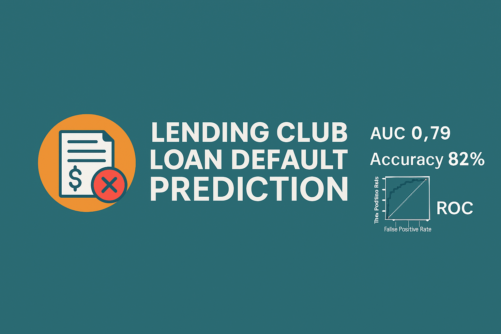

# Lending Club Loan Default Prediction  
### Deep Learning Model for Credit Risk Classification

This project builds a **deep learning model** to predict whether a loan issued by **Lending Club** will be **Fully Paid** or **Charged Off**.  
The dataset contains millions of loan records with borrower information, credit history, financial indicators, and loan performance outcomes.

The goal is to create a **reliable credit risk model** using modern machine learning techniques.

---

## 📌 Project Highlights

- Binary classification: **Fully Paid (1)** vs **Charged Off (0)**
- Complete preprocessing pipeline:
  - Feature selection
  - One-hot encoding for categorical variables
  - Standard scaling
- Deep learning model using:
  - Dense layers
  - Batch Normalization
  - Dropout regularization
- Evaluation metrics:
  - Accuracy
  - Confusion Matrix
  - Classification Report
  - ROC Curve & AUC Score
- Clean, production-ready code
- Reproducible structure for academic or industry use

---

## 📊 Dataset

The dataset is publicly available from **Lending Club** via Kaggle:

**Kaggle Link:**  
https://www.kaggle.com/datasets/wordsforthewise/lending-club

Dataset fields include:

- Loan amount, interest rate, installment  
- Employment length, annual income  
- Credit history (open accounts, public records, revol_util, etc.)  
- Loan grade & sub-grade  
- Application type  
- Loan status (target variable)

---

## 📁 Project Structure
```
lending-club-loan-default-prediction/
│── assets/
│── data/
│     └── travel_insurance.csv            # Dataset
│── results/
│── saved_model/
│     └── model.h5                        # Trained model
│── README.md                             # Project documentation
│── model.py                              # Clean executable training script
│── requirements.txt                      # Dependencies
```

---

## ▶️ How to Run

Install dependencies:
```
pip install -r requirements.txt
```
Run the model:
```
python model.py
```

Outputs will be saved automatically.

---

## 🧠 Model Architecture

The final model uses a **fully connected neural network**, which is the correct approach for tabular financial data.

---

## 📄 License

MIT License
